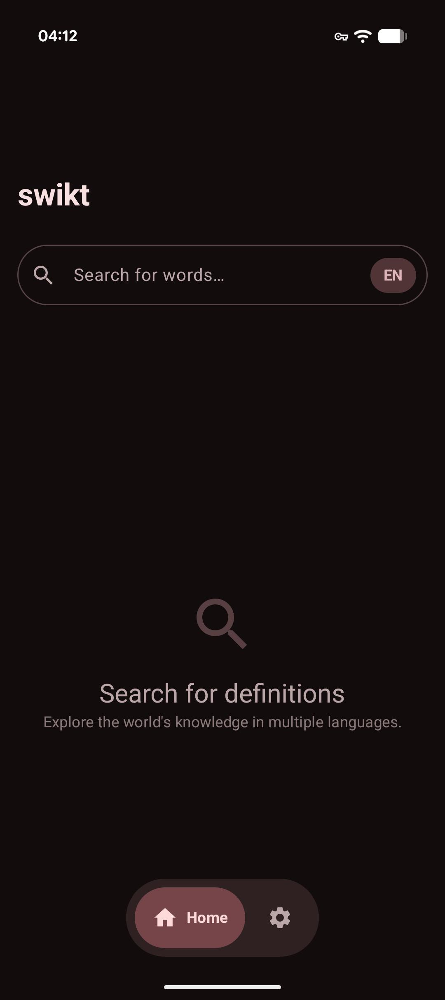
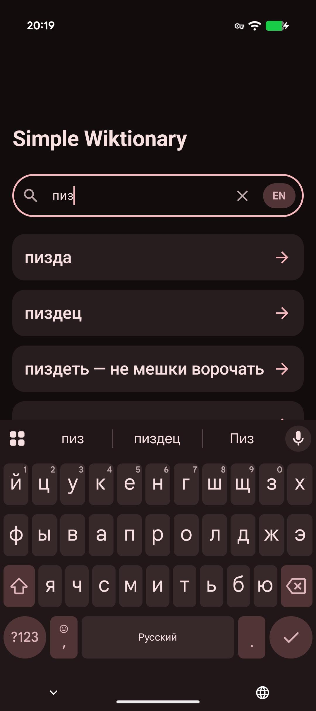
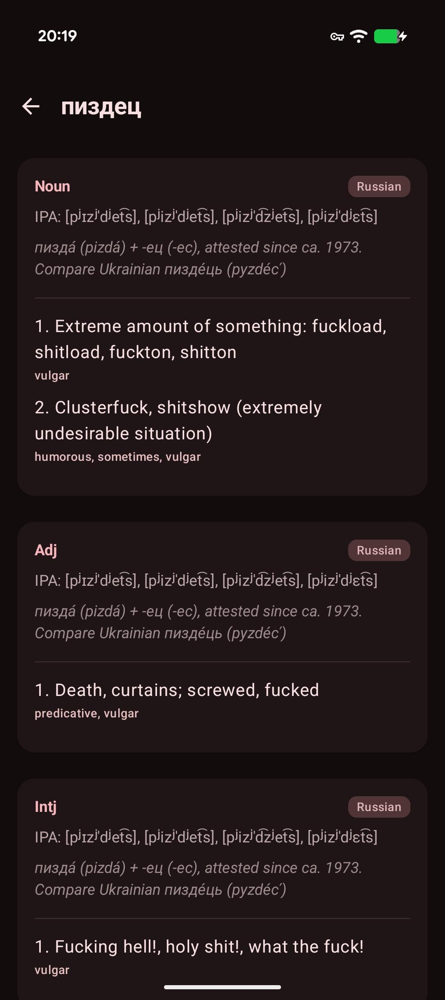

# swikt

[](https://developer.android.com/about/versions/15)
[](https://kotlinlang.org/)
[](https://developer.android.com/compose)
[](https://opensource.org/licenses/MIT)

**swikt** is an entirely vibe-coded fork of [Terciocode's Simple Wiktionary](https://github.com/Terciocode/WiktionaryTercioApp). 
It is an open-source Android dictionary application designed for speed, clarity, and a modern user interface.

---

## Features

- **Performance First**: Optimized for speed using the Wiktionary API and Kaikki.org.
- **Material 3 Interface**: Modern UI featuring a custom floating navigation pill and dynamic, collapsible app bars.
- **Modern UX**: Support for Predictive Back gestures and an Edge-to-Edge layout.
- **Privacy Focused**: No ads, no tracking, and no unnecessary bloat.

---

## Gallery

| Home Screen | Search | Definitions |
| :---: | :---: | :---: |
|  |  |  |
| *Home Screen* | *Search Interface* | *Word Details* |

---

## Tech Stack

Built with standard Android libraries and best practices:

*   **UI**: [Jetpack Compose](https://developer.android.com/compose) with [Material Design 3](https://m3.material.io/)
*   **Networking**: [Retrofit](https://square.github.io/retrofit/) & OkHttp
*   **Serialization**: [Moshi](https://github.com/square/moshi)
*   **Navigation**: [Compose Navigation](https://developer.android.com/jetpack/compose/navigation)
*   **Image Loading**: [Coil](https://coil-kt.github.io/coil/)
*   **Architecture**: MVVM with Clean Architecture principles

---

## Getting Started

### Prerequisites
*   Android Studio Ladybug (or newer)
*   JDK 17+
*   Android SDK 35

### Build Locally
1. **Clone the repository**
   ```bash
   git clone https://github.com/draumaz/swikt.git
   ```
2. **Open in Android Studio**
   Wait for the Gradle sync to complete.
3. **Run the application**
   Select your device and press `Shift + F10`.

---

## Credits and Acknowledgements

- **[Terciocode](https://github.com/Terciocode)**: For the original application foundation.
- **[draumaz](https://github.com/draumaz)**: For the fork and architectural adaptations.
- **Wiktionary & Kaikki.org**: For the open-data APIs.

---

## License

This project is licensed under the **MIT License** - see the [LICENSE](LICENSE) file for details.

---
<p align="center">Developed by draumaz</p>
